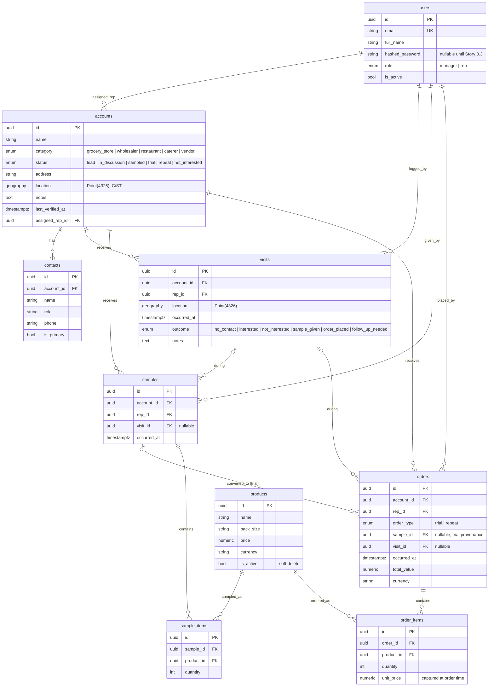

# FoodSupply IQ — Data Model (ERD)

Core schema delivered in **Story 0.2**. All primary keys are UUIDs (generated
client-side by the offline mobile app so syncs are idempotent — Epic 7).
Geospatial columns are PostGIS `geography(Point, 4326)` with GiST indexes.

## Notes & design choices

- **The core loop (Epic 4):** `samples` → `orders(type=trial)` → `orders(type=repeat)`.
  A trial order optionally references the `sample` it converted from, and any
  sample/order optionally references the `visit` it happened during. This is what
  Story 4.4's Sample → Trial → Repeat funnel aggregates over.
- **Line items:** `sample_items` / `order_items` model the many-products-per-event
  relationship. `order_items.unit_price` is captured at order time so later catalog
  price edits never rewrite historical order value.
- **Soft delete:** products use `is_active` rather than hard delete, so historical
  samples/orders keep a valid product reference (`ON DELETE RESTRICT`).
- **Geo:** `accounts.location` and `visits.location` are `geography(Point, 4326)`.
  geoalchemy2 auto-creates the GiST index (`idx_accounts_location`). Distance/
  radius queries use `ST_DWithin` / `ST_Distance` (metres) — see `app/seed.py`.
- **Migrations:** `alembic/versions/` — `0001` enables PostGIS, the core-entities
  revision creates everything above. `alembic/env.py` filters out the PostGIS
  tiger-geocoder / topology tables so autogenerate only manages our tables.
